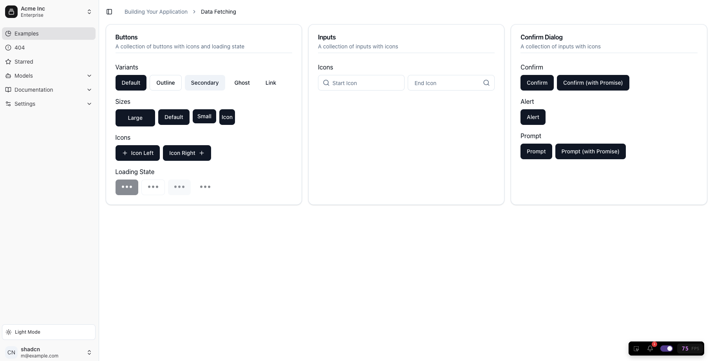
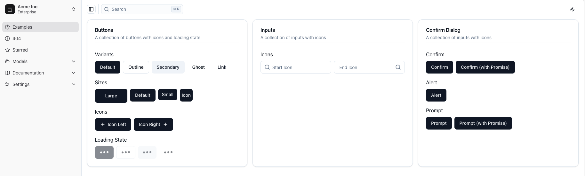
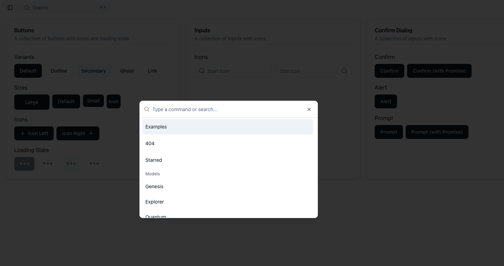
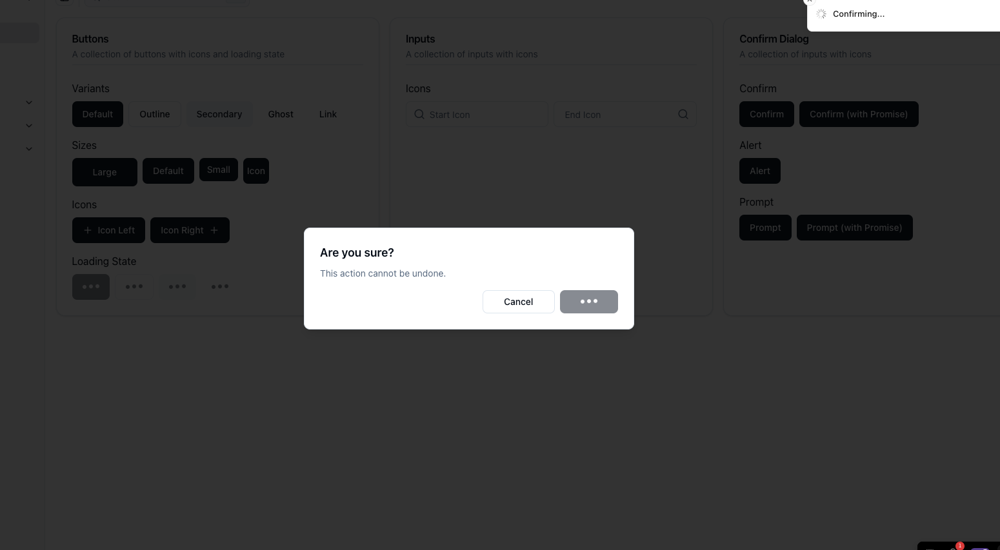
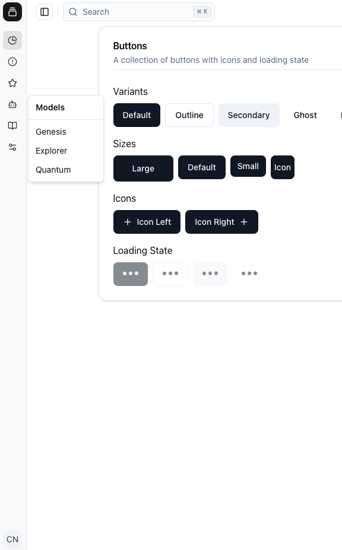
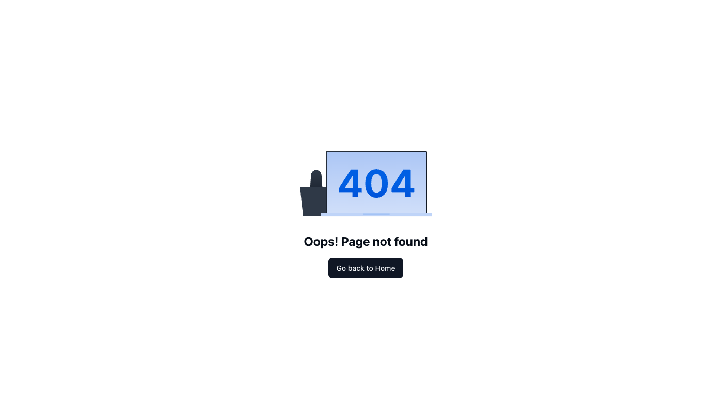
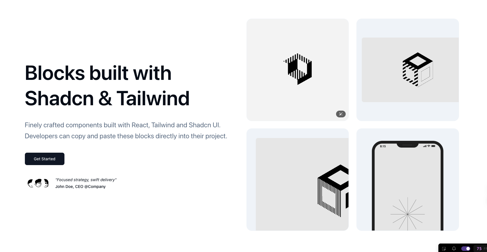

# Next.js 15 + React 19 + Shadcn v4 + Tailwind v4 + React Query

This is a **boilerplate project** designed to provide a solid foundation for building modern web applications with **Next.js 15** and **React 19**. It comes with essential integrations, including **Shadcn v4**, **Tailwind v4**, and **React Query**, optimized for performance and developer experience.

---
<br>

## 🚀 Features

### 📌 Tech Stack
- **Next.js 15** with **React 19** (React Compiler enabled)
- **Shadcn v4 + Tailwind v4** (Dark Mode included)
- **[@tanstack/react-query](https://tanstack.com/query/latest/docs/framework/react/guides/advanced-ssr#experimental-streaming-without-prefetching-in-nextjs)** with `useSuspenseQuery` ([EXPERIMENTAL](https://tanstack.com/query/latest/docs/framework/react/guides/advanced-ssr#experimental-streaming-without-prefetching-in-nextjs))
- **[@biomejs/biome](https://biomejs.dev/)** for linting and formatting
- **[react-scan](https://github.com/aidenybai/react-scan)** for debugging re-renders

### ✅ What's Included?
- **Sidebar & Header with Breadcrumb Navigation**
- **Button Component** (with Icon & Loading state)
- **Input Component** (with Icon)
- **Next.js Top Loader** ([GitHub](https://github.com/TheSGJ/nextjs-toploader))
- **Sonner Shadcn for Toaster Notifications**
- **404 Page with SVG**
- **Landing Page with Shadcn Blocks**
- **Header with 2 styles**:
  - Breadcrumb (`/app`)
  - Search with command palette (`/app?flags=header2`)


## 🔧 How to Use

1. **Clone the Repository**
   ```sh
   git clone https://github.com/hoanggbao00/next15-devkit.git
   ```

2. **Navigate into the Project Directory**
   ```sh
   cd next15-devkit
   ```

3. **Install Dependencies**
   ```sh
   bun install
   ```

4. **Start the Development Server**
   ```sh
   bun dev
   ```

---

## 🛠 Scripts

1. **Install Dependencies**
   ```sh
   bun install
   ```

2. **Run Development Server**
   ```sh
   bun dev
   ```

3. **Check Linting**
   ```sh
   bun check
   ```

4. **Format Code**
   ```sh
   bun format
   ```

5. **Build Project**
   ```sh
   bun build
   ```

6. **Start Built Project**
   ```sh
   bun start
   ```

7. **Add Shadcn Component**
   ```sh
   bun shadcn [component-name] [component-name] ...
   ```

---
Enjoy coding! 🚀

---
## Sreenshots

**Header Style - Breadcrumb**


**Header Style - Search**

**Header Style - Search (Open Command Palette)**


**Confirm with Promise**


**Collapsed Sidebar**


**404 Page**


**Landing Page**


---
Enjoy coding! 🚀
